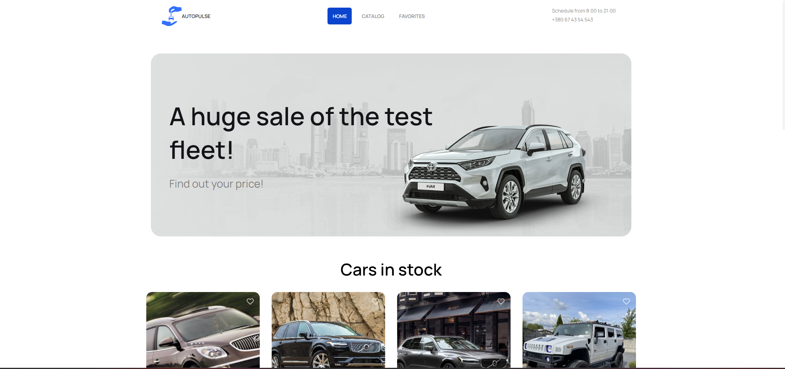
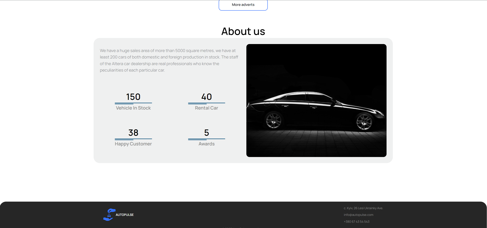
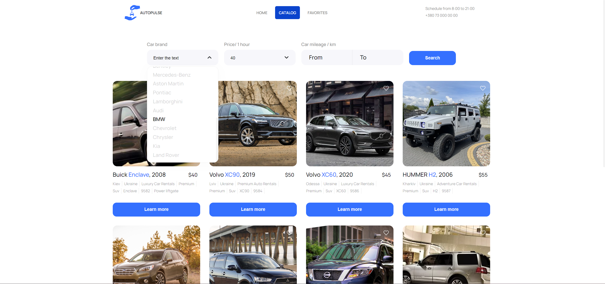
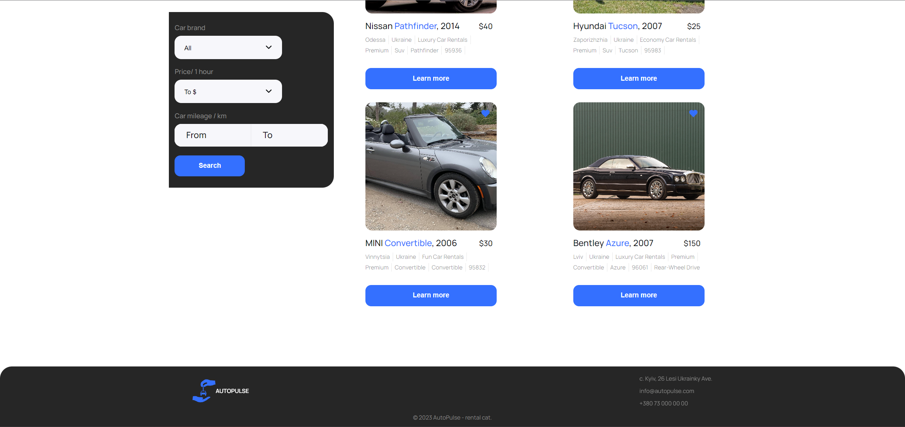

# AutoPulse

## Project Overview

This project is the adaptive site for a car rental company. Site with filters and added favorite adverts and developed the design by the technical specifications. It is built on ReactJS with SASS and uses mockapi.io for interacting with the database.

> [](https://savchyndd.github.io/auto-pulse/)  
> [](https://github.com/savchyndd/auto-pulse)

## Technologies Used

Here are some of the key technologies and libraries used in this project:

 -  -  -  -  - 

## Project's pages

For detailed view of project, refer to the: [`AutoPulse live page`](https://savchyndd.github.io/auto-pulse/)

**Home page**




**Catalog page**



**Favorite page**



## Installation

```bash
$ npm install
```

## Running the app

```bash
# development
$ npm start

# production mode
$ npm run build
```

## Test

```bash
# unit tests
$ npm run test
```
